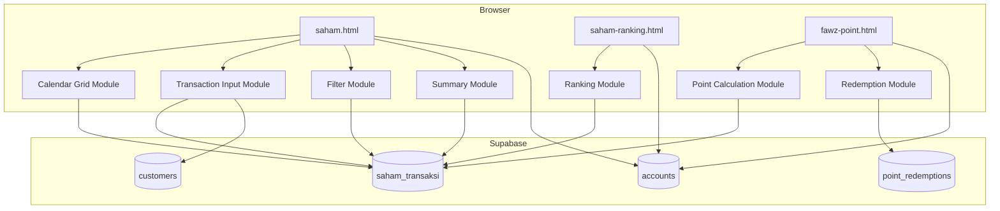
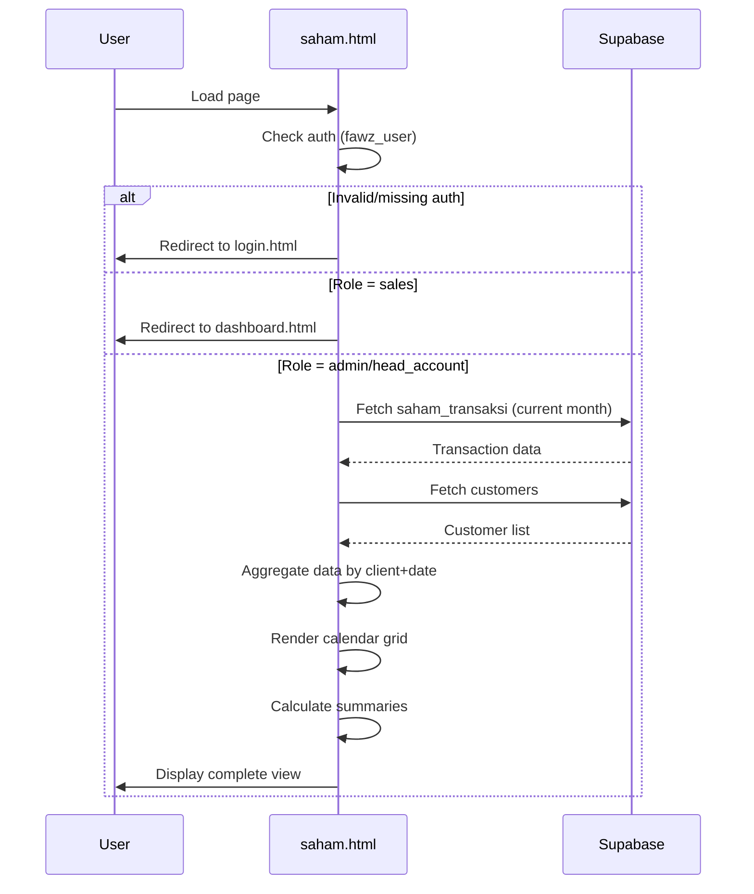
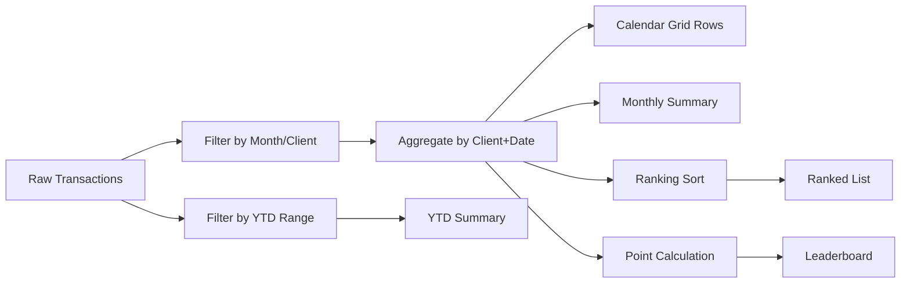

# Design Document: Saham Trading System

## Overview

The Saham Trading System enhances the existing `saham.html` and `fawz-point.html` pages with a comprehensive calendar grid view, daily transaction input, filtering, non-trading day visualization, summaries, rankings, and a point redemption system. The system is built as a pure client-side application using vanilla HTML/CSS/JS with Supabase as the backend, following the existing architectural patterns of the Fawz Pro application.

### Key Design Decisions

1. **No build tools** — All code is vanilla HTML/CSS/JS loaded via CDN (Supabase JS SDK v2), consistent with the existing codebase.
2. **Client-side aggregation** — Data is fetched from Supabase and aggregated in the browser. This avoids the need for database views or stored procedures and keeps the architecture simple.
3. **Static holiday calendar** — The 2026 non-trading day list is hardcoded as a JavaScript constant since it's a fixed dataset that doesn't change at runtime.
4. **Session-based auth** — Uses the existing `fawz_user` sessionStorage/localStorage pattern for role-based access control.
5. **Single-page sections** — The calendar grid, rankings, and summaries are rendered as sections within `saham.html`. The ranking page is a separate `saham-ranking.html`. The point system remains in `fawz-point.html`.

## Architecture



### Data Flow



## Components and Interfaces

### 1. Access Control Module

Runs immediately on page load (IIFE pattern). Validates session and role before any data is fetched or rendered.

```javascript
// Interface
function checkAccess(): { allowed: boolean, user: object | null }
// Returns user object if allowed, redirects otherwise
```

### 2. Holiday Calendar Module

Pure function module that classifies dates as trading or non-trading days.

```javascript
// Interface
const HOLIDAYS_2026: Set<string>  // 'YYYY-MM-DD' format
function isNonTradingDay(dateStr: string): boolean
function getTradingDaysInMonth(year: number, month: number): number
function getNonTradingDaysInMonth(year: number, month: number): string[]
```

### 3. Data Aggregation Module

Pure functions that transform raw transaction arrays into structured grid data.

```javascript
// Interface
function aggregateByClientAndDate(transactions: Transaction[]): Map<string, ClientRow>
function calculateMonthlyTotal(clientRow: ClientRow): { volume: number, fee: number }
function calculateMonthlySummary(transactions: Transaction[]): Summary
function calculateYTDSummary(transactions: Transaction[], selectedMonth: string): Summary

// Types
interface Transaction {
  id: string; tanggal: string; client_id: string; client_name: string;
  volume: number; fee: number; sales_name: string; catatan: string;
}
interface ClientRow {
  client_id: string; client_name: string; sales_name: string;
  days: Map<number, { volume: number, fee: number }>;  // day 1-31
  totalVolume: number; totalFee: number;
}
interface Summary {
  totalVolume: number; totalFee: number; activeClients: number;
}
```

### 4. Calendar Grid Renderer

Renders the aggregated data into an HTML table with date columns 1-31.

```javascript
// Interface
function renderCalendarGrid(
  clientRows: ClientRow[],
  year: number,
  month: number,
  nonTradingDays: Set<number>
): string  // HTML string
```

### 5. Filter Module

Manages month and client filter state, triggers re-renders.

```javascript
// Interface
function getFilteredTransactions(
  allTransactions: Transaction[],
  month: string,
  clientId: string | null
): Transaction[]
function getClientsForMonth(transactions: Transaction[], month: string): ClientOption[]
```

### 6. Input Validation Module

Validates transaction form inputs before submission.

```javascript
// Interface
function validateTransactionInput(input: TransactionInput): ValidationResult
interface TransactionInput {
  tanggal: string; client_id: string; client_name: string;
  volume: string; fee: string;
}
interface ValidationResult {
  valid: boolean; errors: string[];
}
```

### 7. Ranking Module

Sorts and ranks clients by volume or fee for a given month.

```javascript
// Interface
function rankClients(
  transactions: Transaction[],
  field: 'volume' | 'fee'
): RankedClient[]
interface RankedClient {
  rank: number; client_id: string; client_name: string;
  sales_name: string; totalVolume: number; totalFee: number;
}
```

### 8. Fawz Point Module

Calculates points and manages the leaderboard.

```javascript
// Interface
function calculatePoints(totalVolume: number): number
function buildLeaderboard(transactions: Transaction[], redemptions: Redemption[]): LeaderboardEntry[]
interface LeaderboardEntry {
  rank: number; client_id: string; client_name: string;
  totalVolume: number; earnedPoints: number; redeemedPoints: number;
  availablePoints: number;
}
```

### 9. Redemption Module

Handles point redemption validation and recording.

```javascript
// Interface
function validateRedemption(
  requestedPoints: number,
  availablePoints: number
): ValidationResult
function processRedemption(
  clientId: string,
  points: number,
  redeemedBy: string
): Promise<RedemptionResult>
```

## Data Models

### Existing Table: `saham_transaksi`

```sql
CREATE TABLE saham_transaksi (
  id              UUID PRIMARY KEY DEFAULT gen_random_uuid(),
  tanggal         DATE NOT NULL DEFAULT CURRENT_DATE,
  client_id       TEXT NOT NULL,
  client_name     TEXT NOT NULL,
  volume          NUMERIC DEFAULT 0,
  fee             NUMERIC DEFAULT 0,
  sales_name      TEXT,
  catatan         TEXT,
  created_by      TEXT,
  created_at      TIMESTAMPTZ DEFAULT now(),
  updated_at      TIMESTAMPTZ DEFAULT now()
);
```

### New Table: `point_redemptions`

```sql
CREATE TABLE IF NOT EXISTS point_redemptions (
  id              UUID PRIMARY KEY DEFAULT gen_random_uuid(),
  client_id       TEXT NOT NULL,
  client_name     TEXT NOT NULL,
  points_redeemed INTEGER NOT NULL CHECK (points_redeemed >= 1),
  redeemed_by     TEXT NOT NULL,
  redemption_date DATE NOT NULL DEFAULT CURRENT_DATE,
  catatan         TEXT,
  created_at      TIMESTAMPTZ DEFAULT now()
);

CREATE INDEX IF NOT EXISTS idx_point_redemptions_client ON point_redemptions(client_id);
CREATE INDEX IF NOT EXISTS idx_point_redemptions_date ON point_redemptions(redemption_date DESC);

ALTER TABLE point_redemptions DISABLE ROW LEVEL SECURITY;
```

### Holiday Calendar Data Structure (JavaScript constant)

```javascript
const HOLIDAYS_2026 = new Set([
  '2026-01-01', // Tahun Baru
  '2026-01-27', // Isra Miraj
  '2026-01-28', '2026-01-29', // Tahun Baru Imlek
  '2026-03-20', // Hari Raya Nyepi
  '2026-03-29', // Wafat Isa Almasih
  '2026-04-18', // Hari Raya Idul Fitri
  '2026-05-01', // Hari Buruh
  '2026-05-12', // Hari Raya Waisak
  '2026-05-29', // Kenaikan Isa Almasih
  '2026-06-01', // Hari Lahir Pancasila
  '2026-06-06', // Cuti Bersama
  '2026-06-07', // Idul Adha
  '2026-06-08', '2026-06-09', '2026-06-10',
  '2026-06-11', '2026-06-12', '2026-06-13', // Cuti Bersama
  '2026-07-07', // Tahun Baru Islam
  '2026-08-17', // Hari Kemerdekaan
  '2026-09-22', // Maulid Nabi
  '2026-10-02', // Hari Batik
  '2026-12-25', // Natal
  '2026-12-26', // Cuti Bersama Natal
]);
```

### Client-Side Data Flow Model



## Correctness Properties

*A property is a characteristic or behavior that should hold true across all valid executions of a system — essentially, a formal statement about what the system should do. Properties serve as the bridge between human-readable specifications and machine-verifiable correctness guarantees.*

### Property 1: Transaction Aggregation Correctness

*For any* set of transactions with arbitrary clients, dates, volumes, and fees, aggregating by client and date SHALL produce per-cell values equal to the sum of all transaction volumes (and fees) for that specific client on that specific date, and the total column SHALL equal the sum of all daily values for that client.

**Validates: Requirements 1.2, 1.4, 1.6**

### Property 2: Numeric Input Validation

*For any* string input that is negative, non-numeric, or exceeds 999,999,999,999.99, the validation function SHALL reject the input and return an appropriate error message, while accepting all valid numeric values in the range [0, 999999999999.99].

**Validates: Requirements 2.3, 2.4**

### Property 3: Required Field Validation

*For any* transaction input where at least one of tanggal, client_id, or client_name is empty or whitespace-only, the validation function SHALL reject the submission and identify which fields are missing.

**Validates: Requirements 2.7**

### Property 4: Filter Correctness

*For any* set of transactions and any valid month+client filter combination, the filtered result SHALL contain only transactions where the tanggal falls within the selected month AND (if a specific client is selected) the client_id matches the selected client. Additionally, the client dropdown SHALL list exactly the distinct client_ids present in the selected month's data.

**Validates: Requirements 3.2, 3.3, 3.4, 3.5**

### Property 5: Non-Trading Day Classification

*For any* date in the year 2026, the isNonTradingDay function SHALL return true if and only if the date is a Saturday, Sunday, or is in the HOLIDAYS_2026 set, and each date SHALL be counted exactly once regardless of how many categories it belongs to (no double-counting).

**Validates: Requirements 4.1, 4.5, 4.6**

### Property 6: Summary Calculation Correctness

*For any* set of transactions and any selected month, the monthly summary SHALL equal the sum of all volumes and fees for transactions within that month, the YTD summary SHALL equal the sum of all volumes and fees from January 1 through the end of the selected month, and the active client count SHALL equal the number of distinct client_ids in the respective period.

**Validates: Requirements 5.1, 5.2, 5.4**

### Property 7: Ranking Sort Order

*For any* set of client aggregates ranked by a numeric field (volume or fee), the resulting list SHALL be sorted in descending order by that field, with ties broken by client_id in ascending alphabetical order.

**Validates: Requirements 7.1, 7.2, 8.3**

### Property 8: Fawz Point Calculation

*For any* non-negative volume value, the calculated points SHALL equal `Math.floor(volume / 10000000)`, and for any client with transactions across multiple types, the total volume used for calculation SHALL be the sum of all transaction volumes.

**Validates: Requirements 8.1, 8.2**

### Property 9: Point Redemption Balance Invariant

*For any* sequence of point earnings and redemptions for a client, the available point balance SHALL always equal (total earned points minus total redeemed points), and any redemption request exceeding the available balance SHALL be rejected.

**Validates: Requirements 9.2, 9.5**

### Property 10: Redemption History Ordering

*For any* set of redemption records, the displayed history SHALL be sorted by redemption_date in descending order (most recent first).

**Validates: Requirements 9.7**

## Error Handling

### Network Errors

- All Supabase calls are wrapped in try/catch blocks
- On fetch failure: display error toast with message, retain current view state
- On save failure: re-enable form buttons, display error toast, retain form data
- On delete failure: display error toast, record remains visible and unchanged

### Validation Errors

- Form validation runs client-side before any Supabase call
- Invalid inputs: highlight the field, display specific error message below the field
- Required field missing: display "Field X wajib diisi" message
- Numeric out of range: display "Nilai harus antara 0 dan 999.999.999.999,99"

### Authentication Errors

- Missing/invalid session: immediate redirect to login.html (no data rendered)
- Unauthorized role: immediate redirect to dashboard.html (no data rendered)
- Malformed JSON in storage: treat as unauthenticated, redirect to login.html

### Data Integrity

- Point redemption validates available balance before recording
- Delete operations use confirmation dialog to prevent accidental deletion
- Multiple transactions for same client+date are allowed (no unique constraint)

## Testing Strategy

### Property-Based Tests

The system's core logic (aggregation, filtering, validation, point calculation, ranking) consists of pure functions that are ideal for property-based testing. Use **fast-check** (JavaScript PBT library) with minimum 100 iterations per property.

**Test Configuration:**
- Library: `fast-check` (npm package)
- Minimum iterations: 100 per property
- Test runner: Vitest (or Jest)
- Each test tagged with: `Feature: saham-trading-system, Property {N}: {description}`

**Properties to test:**
1. Aggregation correctness (Property 1)
2. Numeric validation (Property 2)
3. Required field validation (Property 3)
4. Filter correctness (Property 4)
5. Non-trading day classification (Property 5)
6. Summary calculations (Property 6)
7. Ranking sort order (Property 7)
8. Point calculation (Property 8)
9. Redemption balance invariant (Property 9)
10. Redemption history ordering (Property 10)

### Unit Tests (Example-Based)

- Access control: verify each role (admin, head_account, sales) gets correct access/redirect
- Holiday calendar: verify all 2026 holidays are correctly listed, verify 239 trading days
- Auto-populate: verify customer lookup by client_id returns correct name/sales
- UI defaults: verify month selector defaults to current month
- Empty states: verify correct messages when no data exists

### Integration Tests

- Transaction CRUD: create, read, delete transactions via Supabase
- Point redemption: record redemption and verify it persists
- Customer lookup: verify customers table query returns expected data

### Manual Testing

- Visual verification of calendar grid layout and red non-trading day columns
- Responsive design on mobile devices
- Toast notification appearance and timing
- Modal open/close behavior
