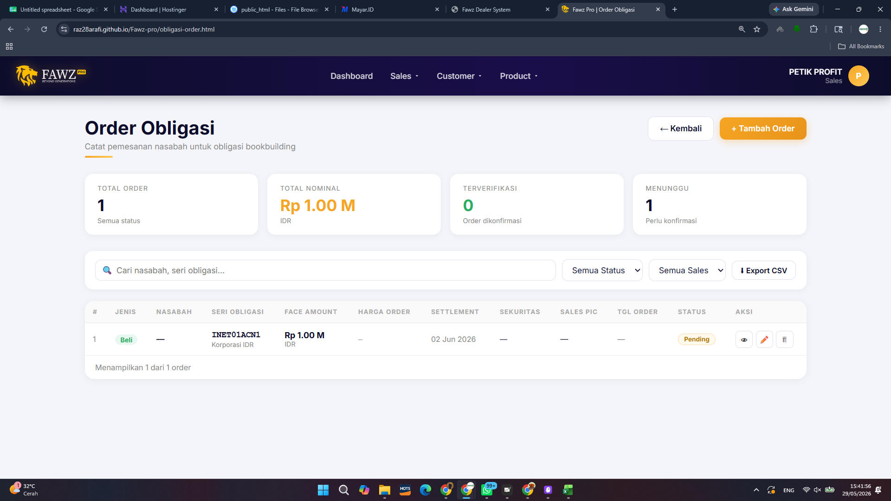

# Requirements Document

## Introduction

Sistem Trading Saham (Saham Trading System) adalah fitur untuk mengelola input harian volume transaksi dan trading fee per nasabah di halaman saham.html. Sistem menampilkan data dalam format tabel kalender bulanan, menyediakan ranking volume dan fee, serta menghitung point loyalitas nasabah. Fitur ini mencakup halaman saham.html (calendar grid view), halaman ranking bulanan, dan halaman fawz-point.html (point leaderboard dengan redeem).

## Glossary

- **Trading_System**: Sistem utama yang mengelola input, tampilan, dan perhitungan data transaksi saham harian
- **Calendar_Grid**: Tampilan tabel berbentuk kalender bulanan dengan kolom tanggal 1-31 untuk setiap client
- **Volume**: Jumlah nominal transaksi saham dalam Rupiah yang dilakukan nasabah pada hari tertentu
- **Trading_Fee**: Biaya transaksi (fee) dalam Rupiah yang dikenakan per transaksi nasabah pada hari tertentu
- **Client_Code**: Kode unik identifikasi nasabah (contoh: C001234)
- **Sales_Code**: Kode unik identifikasi sales/marketing yang menangani nasabah
- **Trading_Day**: Hari kerja bursa (Senin-Jumat) yang bukan hari libur nasional atau cuti bersama
- **Non_Trading_Day**: Hari weekend (Sabtu/Minggu), hari libur nasional, atau cuti bersama yang ditandai merah
- **YTD_Summary**: Ringkasan akumulasi volume dan fee dari awal tahun hingga bulan berjalan
- **Monthly_Summary**: Ringkasan total volume dan fee untuk satu bulan tertentu
- **Ranking_Page**: Halaman terpisah yang menampilkan peringkat nasabah berdasarkan volume dan fee per bulan
- **Fawz_Point**: Sistem point loyalitas dimana setiap Rp 10.000.000 volume transaksi menghasilkan 1 point
- **Point_Redemption**: Proses penukaran point yang telah dikumpulkan oleh nasabah
- **Admin_User**: Pengguna dengan role "admin" di tabel accounts
- **Head_Account_User**: Pengguna dengan role "head_account" di tabel accounts
- **Holiday_Calendar**: Data kalender 2026 yang berisi daftar hari libur nasional dan cuti bersama Indonesia

## Requirements

### Requirement 1: Calendar Grid View - Tampilan Tabel Bulanan

**User Story:** As an Admin_User or Head_Account_User, I want to view daily transaction data in a monthly calendar grid format, so that I can monitor volume and fee per client across the entire month at a glance.

#### Acceptance Criteria

1. THE Calendar_Grid SHALL display data in columns with the following order: No, Client_Code, Customer Name, Sales_Code, Date columns (1 through the last day of the selected month), and Total column
2. WHEN a month is selected, THE Calendar_Grid SHALL display one row per client showing the aggregated Volume (sum of all transactions for that client on that day) in each Trading_Day cell, and a second sub-row showing the aggregated Trading_Fee for the same client and day
3. WHEN a date column corresponds to a Non_Trading_Day (Saturday, Sunday, or a date marked as holiday in the system holiday list), THE Calendar_Grid SHALL render that column header with a red background color to indicate a non-trading day
4. THE Calendar_Grid SHALL calculate and display the Total column as the sum of all daily Volume values for the Volume sub-row and the sum of all daily Trading_Fee values for the Fee sub-row of each client
5. WHEN no transaction data exists for a specific client on a specific Trading_Day, THE Calendar_Grid SHALL display an empty cell (blank) for that date
6. WHEN a client has multiple transactions on the same Trading_Day, THE Calendar_Grid SHALL sum all Volume values and sum all Trading_Fee values for that client on that day and display the aggregated totals in the corresponding cell
7. WHEN the Calendar_Grid page is loaded, THE Calendar_Grid SHALL default the month selector to the current month and display data for that month without requiring manual selection

### Requirement 2: Daily Volume and Fee Input

**User Story:** As an Admin_User or Head_Account_User, I want to input daily volume and trading fee per client, so that transaction data is recorded accurately for each trading day.

#### Acceptance Criteria

1. WHEN the user submits a transaction input with valid data, THE Trading_System SHALL store the tanggal, client_id, client_name, volume, fee, sales_name, and created_by fields in the saham_transaksi table and display a success notification within 3 seconds
2. WHEN the user selects a Client_Code from the input form, THE Trading_System SHALL auto-populate the Customer Name and Sales Person Name from the customers table within 2 seconds
3. IF the user submits a Volume value that is negative or non-numeric, THEN THE Trading_System SHALL reject the submission, retain the form data, and display an error message indicating that Volume must be a numeric value equal to or greater than 0 with a maximum value of 999,999,999,999.99
4. IF the user submits a Trading_Fee value that is negative or non-numeric, THEN THE Trading_System SHALL reject the submission, retain the form data, and display an error message indicating that Trading_Fee must be a numeric value equal to or greater than 0 with a maximum value of 999,999,999,999.99
5. WHEN a transaction is saved successfully, THE Trading_System SHALL refresh the transaction table and monthly statistics to reflect the new data without requiring a full page reload
6. THE Trading_System SHALL allow multiple transaction entries for the same client on the same date, distinguishing entries by their unique record ID
7. IF the user submits the transaction form with tanggal, client_id, or client_name empty, THEN THE Trading_System SHALL reject the submission, retain the form data, and display an error message indicating which required fields are missing

### Requirement 3: Month and Client Filter

**User Story:** As an Admin_User or Head_Account_User, I want to filter the calendar grid by month and client, so that I can focus on specific time periods and specific clients.

#### Acceptance Criteria

1. THE Trading_System SHALL provide a month selector (input type="month") that defaults to the current calendar month based on the user's local system date
2. WHEN a month is selected, THE Calendar_Grid SHALL display only rows where the tanggal field falls within the first and last day (inclusive) of the selected month
3. THE Trading_System SHALL provide a client dropdown filter that defaults to "all clients" and lists all clients that exist in the saham_transaksi table for the selected month
4. WHEN a specific client is selected in the filter, THE Calendar_Grid SHALL display only rows where the client_id matches the selected client within the currently selected month
5. WHEN "all clients" is selected, THE Calendar_Grid SHALL display rows for all clients that have transaction data in the selected month
6. WHEN the selected month or client filter value changes, THE Calendar_Grid SHALL re-render within 2 seconds to reflect the updated filter combination
7. IF no transaction data exists for the selected month and client filter combination, THEN THE Calendar_Grid SHALL display an empty state message indicating no transactions were found for the selected filters

### Requirement 4: Non-Trading Day Calendar (2026)

**User Story:** As an Admin_User or Head_Account_User, I want weekend and holiday dates visually marked in red, so that I can distinguish trading days from non-trading days.

#### Acceptance Criteria

1. THE Holiday_Calendar SHALL classify all Saturdays and Sundays in the year 2026 as Non_Trading_Day
2. THE Holiday_Calendar SHALL classify the following 2026 national holidays as Non_Trading_Day: January 1 (Tahun Baru), January 27 (Isra Miraj), January 28-29 (Tahun Baru Imlek), March 20 (Hari Raya Nyepi), March 29 (Wafat Isa Almasih), April 18 (Hari Raya Idul Fitri), May 1 (Hari Buruh), May 12 (Hari Raya Waisak), May 29 (Kenaikan Isa Almasih), June 1 (Hari Lahir Pancasila), June 7 (Idul Adha), July 7 (Tahun Baru Islam), August 17 (Hari Kemerdekaan), September 22 (Maulid Nabi), October 2 (Hari Batik), December 25 (Natal), December 26 (Cuti Bersama Natal)
3. THE Holiday_Calendar SHALL classify the following 2026 cuti bersama dates as Non_Trading_Day: June 6, June 8-13 (Cuti Bersama Idul Adha dan sekitarnya)
4. WHEN the Calendar_Grid renders a date column that is classified as Non_Trading_Day, THE Trading_System SHALL apply a red background color to that column's header cell (th element) to visually distinguish it from Trading_Day columns
5. THE Holiday_Calendar SHALL produce exactly 239 Trading_Days for the year 2026, where Trading_Days equals 365 total days minus all unique Non_Trading_Day dates (weekends, national holidays, and cuti bersama combined without double-counting dates that fall on both a weekend and a holiday)
6. IF a national holiday or cuti bersama date falls on a Saturday or Sunday, THEN THE Holiday_Calendar SHALL count that date as a single Non_Trading_Day without duplication

### Requirement 5: YTD and Monthly Summary

**User Story:** As an Admin_User or Head_Account_User, I want to see Year-To-Date and monthly volume/fee summaries, so that I can track overall performance trends.

#### Acceptance Criteria

1. THE Trading_System SHALL display a Monthly_Summary section showing total volume and total fee for the currently selected month, where values are the sum of all saham_transaksi records with a tanggal falling within the selected calendar month, formatted in Rupiah (Rp) with Indonesian locale thousand separators
2. THE Trading_System SHALL display a YTD_Summary section showing accumulated total volume and total fee for all saham_transaksi records with a tanggal from January 1 of the current year through the last calendar day of the selected month (inclusive), formatted in Rupiah (Rp) with Indonesian locale thousand separators
3. WHEN the month filter changes, THE Trading_System SHALL recalculate and update both Monthly_Summary and YTD_Summary values within 3 seconds of the filter change
4. THE Trading_System SHALL display the number of active clients (distinct client_id values with at least one saham_transaksi record) for both the monthly period and the YTD period
5. IF no transactions exist for the selected monthly or YTD period, THEN THE Trading_System SHALL display "Rp 0" for volume and fee totals and "0" for active client count
6. WHEN the page loads, THE Trading_System SHALL default the month filter to the current calendar month and display the corresponding Monthly_Summary and YTD_Summary values

### Requirement 6: Access Control

**User Story:** As a system administrator, I want to restrict access to the saham trading pages to authorized roles only, so that sensitive financial data is protected.

#### Acceptance Criteria

1. WHEN a user with role "admin" accesses saham.html, THE Trading_System SHALL grant full access to view all transaction data and input new transactions
2. WHEN a user with role "head_account" accesses saham.html, THE Trading_System SHALL grant full access to view all transaction data and input new transactions
3. WHEN a user with role "sales" accesses saham.html, THE Trading_System SHALL deny access and redirect to dashboard.html within 1 second of page load
4. WHEN a page loads and no valid JSON object containing name, username, and role fields exists under key "fawz_user" in sessionStorage or under key "fawz_user_remember" in localStorage, THE Trading_System SHALL redirect to login.html within 1 second of page load
5. THE Trading_System SHALL apply the same role-based access rules defined in criteria 1 through 3 to fawz-point.html, restricting access to users with role "admin" or "head_account" and denying access to users with role "sales"
6. IF the stored fawz_user value exists but contains invalid JSON or is missing the role field, THEN THE Trading_System SHALL treat the user as unauthenticated and redirect to login.html within 1 second of page load
7. WHEN a user with role "sales" is denied access and redirected, THE Trading_System SHALL not display any saham transaction data before the redirect occurs

### Requirement 7: Monthly Ranking Page

**User Story:** As an Admin_User or Head_Account_User, I want to view a monthly ranking of clients by volume and fee, so that I can identify top-performing clients.

#### Acceptance Criteria

1. THE Ranking_Page SHALL display a list of clients ranked by total Volume in descending order for the selected month, with ties broken by Client_Code in ascending alphabetical order
2. THE Ranking_Page SHALL display a separate ranking of clients by total Trading_Fee in descending order for the selected month, with ties broken by Client_Code in ascending alphabetical order
3. THE Ranking_Page SHALL provide a month filter that defaults to the current month and allows selection of any month for which to display rankings
4. WHEN the month filter changes, THE Ranking_Page SHALL recalculate and re-render both rankings for the newly selected month
5. THE Ranking_Page SHALL display for each ranked client: rank position, Client_Code, Customer Name, Sales_Code, total Volume formatted in Rupiah with "Rp" prefix and Indonesian locale separators, and total Trading_Fee formatted in Rupiah with "Rp" prefix and Indonesian locale separators
6. IF no transaction data exists for the selected month, THEN THE Ranking_Page SHALL display an empty state message indicating that no ranking data is available for the selected month

### Requirement 8: Fawz Point Calculation

**User Story:** As an Admin_User or Head_Account_User, I want the system to calculate loyalty points based on transaction volume, so that clients are rewarded for their trading activity.

#### Acceptance Criteria

1. THE Fawz_Point system SHALL calculate points using the formula: points = floor(total_volume / 10,000,000), where total_volume is the sum of all transaction volumes for a client within the selected calendar month (day 1 through last day of month inclusive)
2. THE Fawz_Point system SHALL accumulate volume from all transaction types (saham, warrant, bonds) for point calculation
3. THE Fawz_Point system SHALL display a leaderboard of clients ranked by accumulated points in descending order, with ties broken by higher total volume first
4. THE Fawz_Point system SHALL display for each client: rank position, Client_Code, Customer Name, total Volume formatted in Rupiah, and calculated points
5. WHEN the month filter changes, THE Fawz_Point system SHALL recalculate points based on the selected month's transactions and update the leaderboard within 5 seconds
6. WHEN the page loads, THE Fawz_Point system SHALL default the month filter to the current calendar month and display the corresponding leaderboard
7. IF no transaction data exists for the selected month, THEN THE Fawz_Point system SHALL display an empty state message indicating no data is available for the selected period
8. THE Fawz_Point system SHALL include clients with zero points (volume below 10,000,000) in the leaderboard, displaying their volume and a point value of 0

### Requirement 9: Point Redemption

**User Story:** As an Admin_User or Head_Account_User, I want to process point redemptions for clients, so that clients can use their earned points.

#### Acceptance Criteria

1. THE Fawz_Point system SHALL provide a redeem point interface accessible only to Admin_User and Head_Account_User, containing a client selector, a numeric input for points to redeem (minimum 1 point, maximum equal to the client's available balance), and a submit button
2. WHEN a redemption is submitted, THE Fawz_Point system SHALL validate that the client has sufficient available points (calculated as total earned points minus total previously redeemed points) for the requested redemption amount
3. IF the client has insufficient points, THEN THE Fawz_Point system SHALL display an error message indicating the current available point balance and prevent the redemption from being recorded
4. WHEN a redemption is processed successfully, THE Fawz_Point system SHALL record the redemption with client_id, points_redeemed, redeemed_by, and redemption_date in the point_redemptions table
5. WHEN a redemption is processed successfully, THE Fawz_Point system SHALL subtract redeemed points from the client's available point balance in the leaderboard display within 2 seconds of submission
6. IF the redemption amount is less than 1 point, THEN THE Fawz_Point system SHALL reject the submission and display an error message indicating the minimum redemption is 1 point
7. THE Fawz_Point system SHALL display a redemption history list showing all past redemptions with client name, points redeemed, redeemed_by, and redemption_date, sorted by most recent first

### Requirement 10: Data Deletion

**User Story:** As an Admin_User or Head_Account_User, I want to delete incorrect transaction entries, so that data accuracy is maintained.

#### Acceptance Criteria

1. WHEN the user clicks the delete button on a transaction row, THE Trading_System SHALL display a confirmation dialog that asks the user to confirm or cancel the deletion of that specific record
2. IF the user cancels or dismisses the confirmation dialog, THEN THE Trading_System SHALL take no action and the transaction record SHALL remain unchanged in the saham_transaksi table and in the displayed view
3. WHEN the user confirms deletion, THE Trading_System SHALL remove the record from the saham_transaksi table and remove it from the local data set
4. IF the deletion operation fails due to a network error or database error, THEN THE Trading_System SHALL display an error notification indicating the deletion failed, and the transaction record SHALL remain visible and unchanged in the view
5. WHEN a record is deleted successfully, THE Trading_System SHALL refresh the transaction table, summary statistics (Total Volume, Total Fee, Jumlah Transaksi, Nasabah Aktif), and the Rekap Bulanan per Nasabah section to reflect the removal
6. WHEN a record is deleted successfully, THE Trading_System SHALL display a success notification confirming the record has been removed
